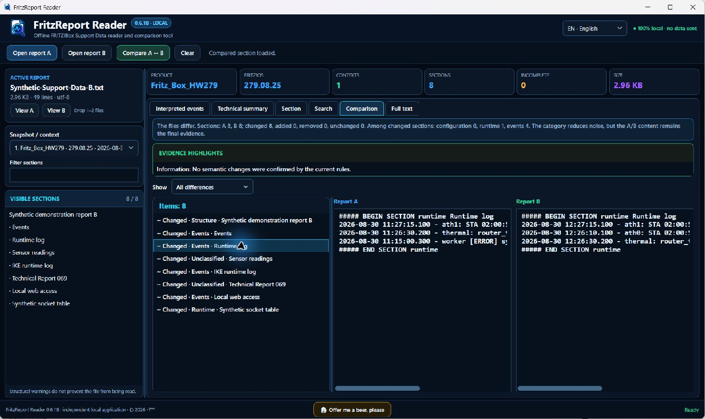
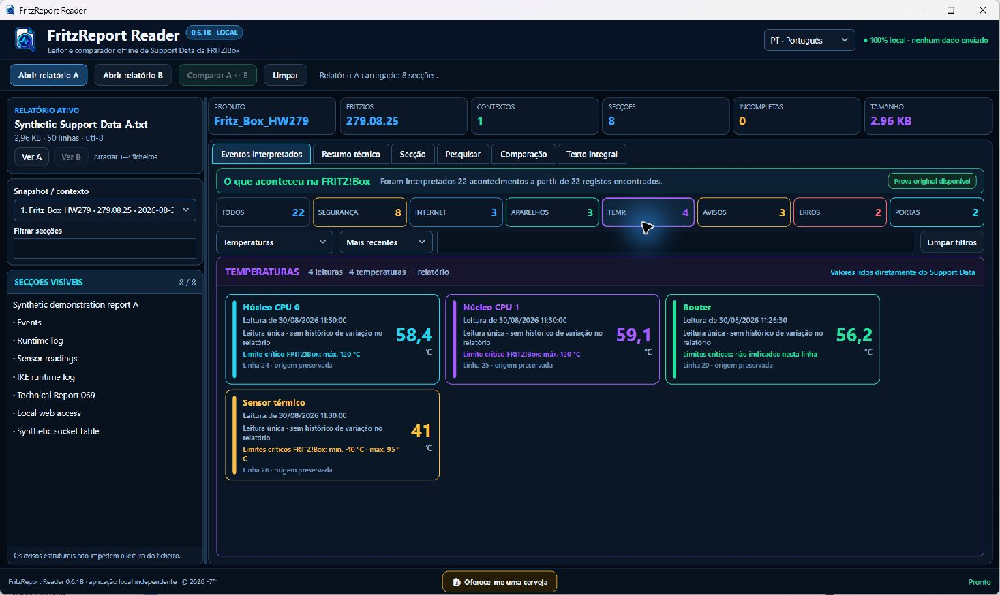
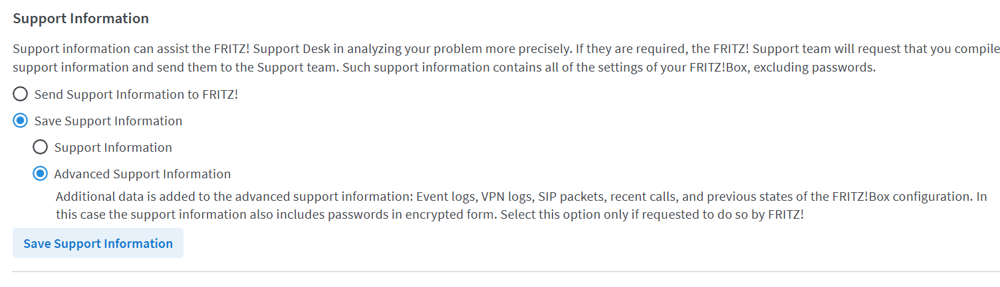

<p align="center">
  
</p>

# FritzReport Reader

<p align="center">
  
  
  
  
  <a href="https://github.com/i7even/FritzReportReader/releases/latest"></a>
  
  <a href="https://www.virustotal.com/gui/file/f5a51376b96663b02321fbaef6bd6f7b61ba17f0600b58095b1ea416cd0115a1/detection"></a>
  
  
</p>

Offline reader and comparator for FRITZ!Box **Support Data** reports.<br>
Leitor e comparador local para relatórios **Support Data** da FRITZ!Box.

**Version / Versão:** 0.6.1B beta · **Windows x64** · portable, no installer · portátil, sem instalador

[**Download the executable / Transferir o executável**](https://github.com/i7even/FritzReportReader/releases/latest)
· [Privacy / Privacidade](PRIVACY.md)
· [Security / Segurança](SECURITY.md)
· [Donate / Doar](https://www.paypal.com/donate/?hosted_button_id=REKGGB7F68J6W)

> Source code is not included in this repository. The application is distributed as a proprietary binary through GitHub Releases.<br>
> O código-fonte não faz parte deste repositório. A aplicação é distribuída como binário proprietário nos GitHub Releases.

## Screenshots / Capturas





The screenshots use synthetic reports only. They contain no data from a real FRITZ!Box.<br>
As capturas usam exclusivamente relatórios sintéticos. Não contêm dados de uma FRITZ!Box real.

---

## English

### What it does

FritzReport Reader opens `.txt` and `.log` files created by the FRITZ!Box Support Data page and turns technical records into an organised view without modifying the original file.

- builds a timeline with date, time, category, result and plain-language explanation;
- retains each original line as evidence and opens its source section;
- extracts IP, MAC, device, protocol, local port, remote port and values when present;
- separates security/access, Internet/WAN, devices/Wi-Fi, temperatures, warnings, errors and external port activity;
- does not call a rejected attempt or negotiation an “attack” without sufficient evidence;
- keeps observed temperature ranges and FRITZ!Box critical limits separate;
- organises technical sections, including socket tables;
- searches the report, a snapshot or one section;
- compares two reports and lists added, removed, changed and unchanged sections;
- preserves the original bytes and calculates SHA-256;
- works fully offline with no telemetry, account, updater or automatic data transfer;
- provides English (UK) and Portuguese (Portugal), switchable without restarting.

### Download and run

1. Open [Releases](https://github.com/i7even/FritzReportReader/releases/latest).
2. Under **Assets**, download `FritzReportReader-v0.6.1B-win-x64.exe`.
3. Optionally download `SHA256SUMS.txt` and verify the file:

   ```powershell
   Get-FileHash .\FritzReportReader-v0.6.1B-win-x64.exe -Algorithm SHA256
   ```

4. Run the executable. There is no installer and administrator rights are not required.

This beta does not yet have a publicly trusted Authenticode signature, so Windows may show **Unknown publisher** even when the file matches the published hash. Do not ignore antivirus warnings: verify the name, source, SHA-256 and the current [security information](SECURITY.md).

### How to obtain a FRITZ!Box support report

These instructions were checked against the official documentation for the **FRITZ!Box 5690 Pro**. The official firmware directory currently lists **FRITZ!OS 8.25** for this model. Labels can vary slightly with another FRITZ!OS version or interface language.

#### Advanced report — required for the complete analysis

FritzReport Reader is designed for **Advanced Support Information**. Do not select the basic **Support Information** option when you need the complete event, VPN, SIP and previous-state records: the standard report can omit those additional data.

1. Connect the computer to the main FRITZ!Box home network; do not use guest access.
2. Open `http://fritz.box` and sign in.
3. Open `http://fritz.box/support.lua` in the browser address bar.
4. In the save section, select **Save Support Information**, then **Advanced Support Information**.
5. Click **Save Support Information**.
6. If additional confirmation is requested, confirm it on the FRITZ!Box.
7. Select **Save** and wait; creating the file can take a few minutes.
8. Keep the original TXT name and format.
9. In FritzReport Reader, choose **Open report A**. To compare two captures, open report B and choose **Compare A ↔ B**.



When diagnosing a fault, create the report while or immediately after the issue and do not restart the FRITZ!Box before saving it. FRITZ! recommends a computer or Android device; an iPhone or iPad can save an incomplete file.

Official sources: [advanced report](https://fritz.com/en/apps/knowledge-base/FRITZ-Box-5690-Pro/2190_Generating-advanced-support-data-for-the-FRITZ-Box), [open the interface](https://fritz.com/en/apps/knowledge-base/FRITZ-Box-5690-Pro/1_Opening-the-FRITZ-Box-user-interface), and [official firmware](https://download.avm.de/fritzbox/fritzbox-5690-pro/other/fritz.os/).

### Essential privacy notice

A Support Data file may contain event logs, settings, IPs, MACs, device names, phone numbers, certificates, keys and encrypted passwords. FritzReport Reader processes the file locally, but that does not make the report safe to publish.

- do not publish the report on GitHub;
- do not upload it to forums or public analysis services;
- do not use real data in screenshots;
- when opening an issue, describe the problem without attaching the report; redact every identifier before sharing individual lines.

The files in [`samples`](samples/) are fully synthetic and can be used to try the application.

---

## Português

### O que faz

O FritzReport Reader abre ficheiros `.txt` e `.log` gerados pela área Support Data da FRITZ!Box e transforma os registos técnicos numa leitura organizada, sem alterar o ficheiro original.

- cria uma cronologia com data, hora, categoria, resultado e explicação;
- mantém cada linha original como prova e abre a secção de origem;
- extrai IP, MAC, aparelho, protocolo, porta local, porta remota e valores quando existem no relatório;
- separa segurança/acessos, Internet/WAN, aparelhos/Wi-Fi, temperaturas, avisos, erros e atividade externa em portas;
- não chama “ataque” a uma tentativa ou negociação rejeitada sem prova suficiente;
- mostra temperaturas observadas, mínimo/máximo observados e limites críticos como conceitos diferentes;
- organiza secções técnicas, incluindo tabelas de sockets;
- pesquisa no relatório, no snapshot ou numa secção;
- compara dois relatórios e mostra secções adicionadas, removidas, alteradas e iguais;
- preserva os bytes originais e calcula SHA-256;
- funciona totalmente offline, sem telemetria, conta, atualizador ou envio automático de dados;
- oferece interface em Português (Portugal) e English (UK), alterável sem reiniciar.

### Transferir e executar

1. Abra [Releases](https://github.com/i7even/FritzReportReader/releases/latest).
2. Em **Assets**, transfira `FritzReportReader-v0.6.1B-win-x64.exe`.
3. Opcionalmente, transfira `SHA256SUMS.txt` e confirme o hash com:

   ```powershell
   Get-FileHash .\FritzReportReader-v0.6.1B-win-x64.exe -Algorithm SHA256
   ```

4. Execute o ficheiro. Não existe instalador e não são necessários privilégios de administrador.

Esta versão ainda não tem assinatura Authenticode pública. Por isso, o Windows pode indicar **Editor desconhecido** mesmo quando o ficheiro corresponde ao hash publicado. Não ignore um alerta do antivírus: confirme o nome, a origem, o SHA-256 e a [informação de segurança](SECURITY.md) atual.

### Como obter o relatório da FRITZ!Box

Estas instruções foram verificadas na documentação oficial específica da **FRITZ!Box 5690 Pro**. O diretório oficial da FRITZ! lista atualmente o **FRITZ!OS 8.25** para este modelo. Os nomes dos controlos ficam em inglês para coincidirem com a interface inglesa descrita pela FRITZ!; podem variar ligeiramente noutra versão ou idioma.

#### Relatório avançado — necessário para a análise completa

O FritzReport Reader foi concebido para **Advanced Support Information**. Não selecione a opção básica **Support Information** quando precisa dos registos completos de eventos, VPN, SIP e estados anteriores: o relatório normal pode omitir esses dados adicionais.

1. Ligue o computador à rede principal da FRITZ!Box; não utilize a rede de convidados.
2. Abra `http://fritz.box` e inicie sessão.
3. Na barra de endereços, abra `http://fritz.box/support.lua`.
4. Na área de gravação, selecione **Save Support Information** e depois **Advanced Support Information**.
5. Clique em **Save Support Information**.
6. Se for pedida confirmação adicional, confirme diretamente na FRITZ!Box.
7. Escolha **Save** e aguarde; a criação pode demorar alguns minutos.
8. Guarde o TXT sem alterar o nome nem o formato.
9. No FritzReport Reader, escolha **Abrir relatório A**. Para comparar, abra também o relatório B e escolha **Comparar A ↔ B**.


Para analisar uma falha, crie o relatório durante ou logo após o problema e não reinicie a FRITZ!Box antes de o guardar. A FRITZ! recomenda um computador ou Android; num iPhone ou iPad o ficheiro pode ficar incompleto.

Fontes oficiais: [relatório avançado](https://fritz.com/en/apps/knowledge-base/FRITZ-Box-5690-Pro/2190_Generating-advanced-support-data-for-the-FRITZ-Box), [abrir a interface](https://fritz.com/en/apps/knowledge-base/FRITZ-Box-5690-Pro/1_Opening-the-FRITZ-Box-user-interface) e [firmware oficial](https://download.avm.de/fritzbox/fritzbox-5690-pro/other/fritz.os/).

### Privacidade essencial

Um Support Data pode conter o registo de eventos, configurações, IPs, MACs, nomes de aparelhos, números de telefone, certificados, chaves e palavras-passe cifradas. O FritzReport Reader processa o ficheiro localmente, mas isso não torna o relatório seguro para publicação.

- não publique o relatório no GitHub;
- não o envie para fóruns ou serviços públicos de análise;
- não use dados reais em screenshots;
- ao abrir um issue, descreva o problema sem anexar o relatório; se precisar de mostrar linhas, remova primeiro todos os identificadores.

Os ficheiros em [`samples`](samples/) são inteiramente fictícios e podem ser usados para experimentar a aplicação.

## Security, licence and trademarks

- [Security information and vulnerability reporting](SECURITY.md)
- [Privacy policy](PRIVACY.md)
- [Proprietary binary licence](LICENSE.md)
- [Third-party notices](THIRD-PARTY-NOTICES.md)
- [Release notes](RELEASE_NOTES.md)
- [Changes in this version](CHANGELOG.md)

Copyright © 2026 **-7™**. All rights reserved.

FritzReport Reader is independent and is not affiliated with, sponsored by or endorsed by AVM/FRITZ!. FRITZ!Box, FRITZ! and all other referenced marks belong to their respective owners.
